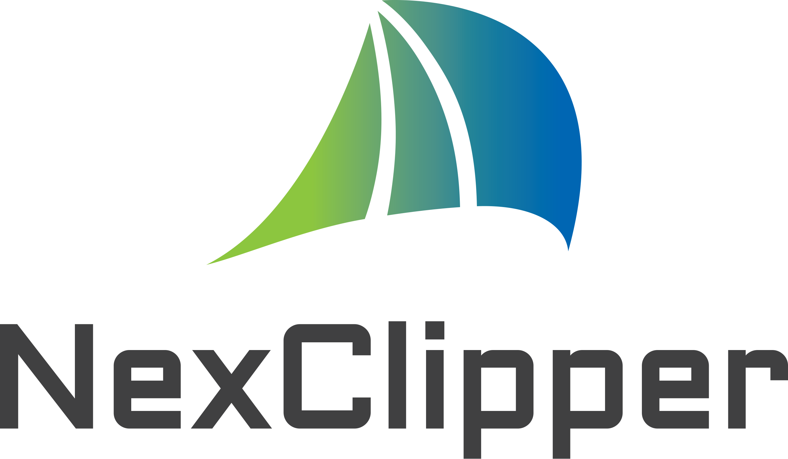
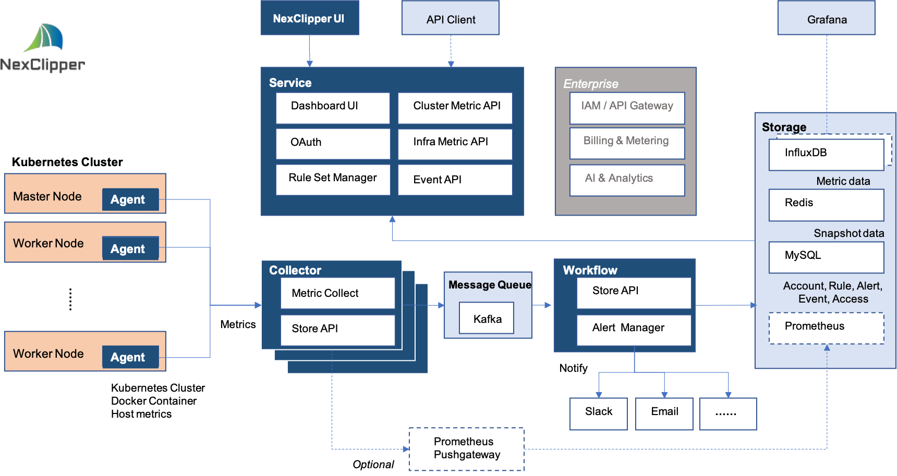

# NexClipper

NexClipper is the container and container orchestration monitoring and performance management solution specialized in Docker, DC/OS, Mesosphere, Kubernetes. NexClipper Cloud especilly supports machine learning based predictive, forecasting, anormaly detection.

There are two different versions of NexClipper: NexClipper Cloud and NexClipper.

Please note that previsous NexClipper Light project which was host level container monitoring tool was moved to [NexLight](https://github.com/NexClipper/NexClipper/tree/master/NexLight) directory.

## NexClipper Cloud

NexClipper Cloud is an online SaaS to monitor and manage performance of the container cluster -  Docker, DC/OS and Kubernetes.
NexClipper Cloud features the following capabilities:
- Fullstack dashboard (Infrastructure, DC/OS, Kubernetes)
- Container Cluster (DC/OS, Kuberentes)
- Service Performance (for API)
- Infrastruture Monitoring (Container, Host, Resource)
- Incidents Management
- AI Analytics (Forecasting, Anomaly detection, Metric correlation)

For more details visit  https://www.nexclipper.com/
For beta service, visit https://server.nexclipper.com

## NexClipper  

NexClipper is an open source software to monitor and manage performance of the container cluster -  Docker and Kubernetes.
NexClipper features the following capabilities:
- Fullstack dashboard (Infrastructure, Kubernetes)
- Container Cluster (Kuberentes)
- Infrastruture Monitoring (Container, Host, Resource)
- Incidents Management

## Architeture Overview

## Install

There are various ways of installing NexClipper.

### Precompiled binaries

### Docker images

Docker image

    $ nexclipper/nexagent

NexClipper will...

### Building from source

How to Build

    $ go get...
    $ yaml

## Licensing

NexClipper is licensed under the Apache License, Version 2.0. See [LICENSE](https://github.com/NexClipper/NexClipper/blob/master/LICENSE) for the full license text.

## Contact

Email: nexclipper@nexclipper.com

Homepage: https://www.nexclipper.com/

Facebook : https://www.facebook.com/nexclipper/

Linkedin: https://www.linkedin.com/company/nexcloud/

Twitter: https://twitter.com/NexClipper
